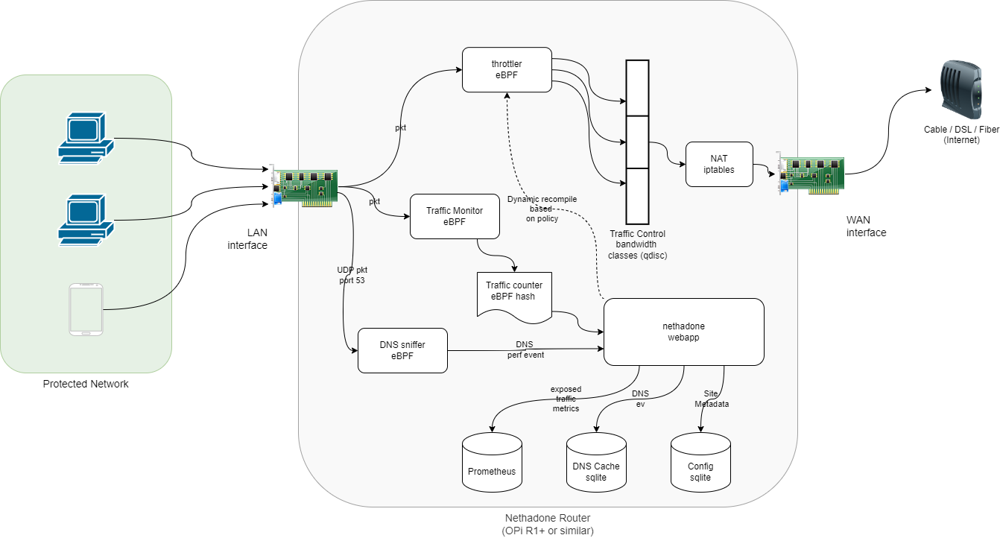

# Nethadone

Nethadone is an adaptive L4 router built to discourage and train users on a network
out of compulsive or addictive web usage.

It uses [eBPF](https://ebpf.io/) to efficiently monitor and dynamically adjust traffic
speeds
to gently nudge users off of configured sites. The goal is to
get the benefit of these platforms (occasional surfing, ability to respond to messages, 
etc.) while avoiding the downsides of excessive use.

## Getting Started

Nethadone is in active development and only been tested on an 
[Orange Pi R1 Plus](http://www.orangepi.org/orangepiwiki/index.php/Orange_Pi_R1_Plus).
If you are interested in giving it a try on a similar device,
please check out `doc/install.md` for details, feedback and
contributions are more than welcome!

For development or testing on a local VM, please see 
`doc/development.md` 

## How does it work? 

Nethadone leverages several eBPF programs to monitor and classify
routed traffic as it passes through. Based on the configured
policies, packets are slotted into a series of bandwidth classes.
The default configuration corresponds roughly to:

* Full throttle (no restriction)
* Decent DSL connection
* Good 4G connection
* Flaky 3G connection
* A top of the line US Robotics 56K modem

As a user continues to compulsively use a given site, traffic 
to flagged IPs gradually works its way down the list above.

Nethadone currently only supports a single policy, for more details
see `policy/README.md`.

For more details on bandwidth classes (i.e. qdisc configuration), see `doc/qdisc.md`

### Traffic flow

The following diagram shows the approximate life of a packet as
it flows through the nethadone router, and 
most of the moving parts involved:

## Design Goals

* Protect all devices in a network with zero client-side configuration or software
* Dynamically throttle traffic from clients to configurable sites or groups of sites to "train" good habits [1]
* Use only IP and (sniffed) DNS (i.e. as close to a pure L4 solution as possible)
* Introduce no latency on "good" traffic
* Usable on minimal hardware like an Orange Pi R1plus or similar

## References & Acknowlegements

### Projects

A number of projects were invaluable reference points
in trying to understand the intracies of eBPF:

* [Dae](https://github.com/daeuniverse/dae/)
* [Flat](https://github.com/pouriyajamshidi/flat)
* [Grafana Beyla](https://github.com/grafana/beyla)

While a very different technical solution, the product experience of [Pi-hole](https://github.com/pi-hole/pi-hole) from the users' persective is a huge inspiration for nethadone.

### Papers and Books

[Learning eBPF - Full Book](https://cilium.isovalent.com/hubfs/Learning-eBPF%20-%20Full%20book.pdf)

[Replacing HTB with EDT and BPF](https://netdevconf.info//0x14/pub/papers/55/0x14-paper55-talk-paper.pdf)

[Scaling Linux Traffic
Shaping with BPF](http://vger.kernel.org/lpc_bpf2018_talks/lpc-bpf-2018-shaping.pdf)

[Understanding tc “direct action” mode for BPF](https://qmonnet.github.io/whirl-offload/2020/04/11/tc-bpf-direct-action/)

[Linux Advanced Routing & Traffic Control HOWTO](https://lartc.org/lartc.html)