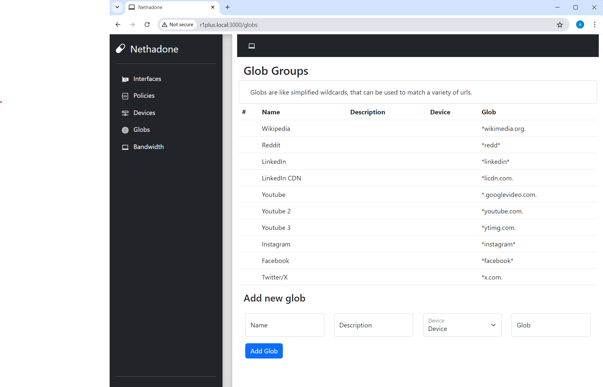
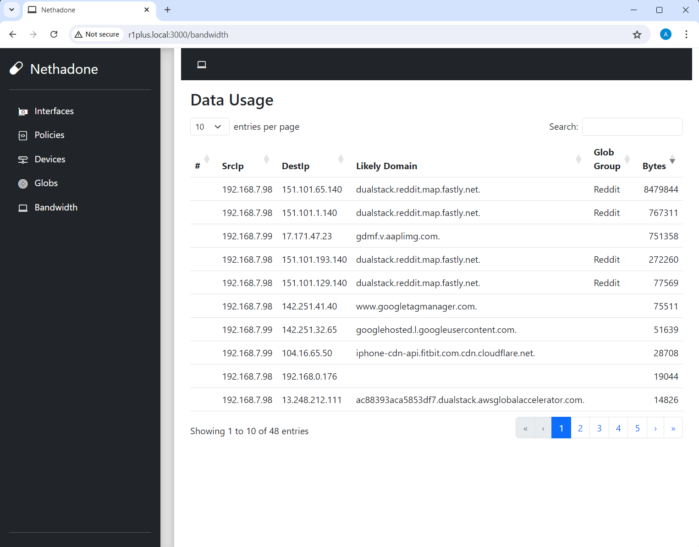
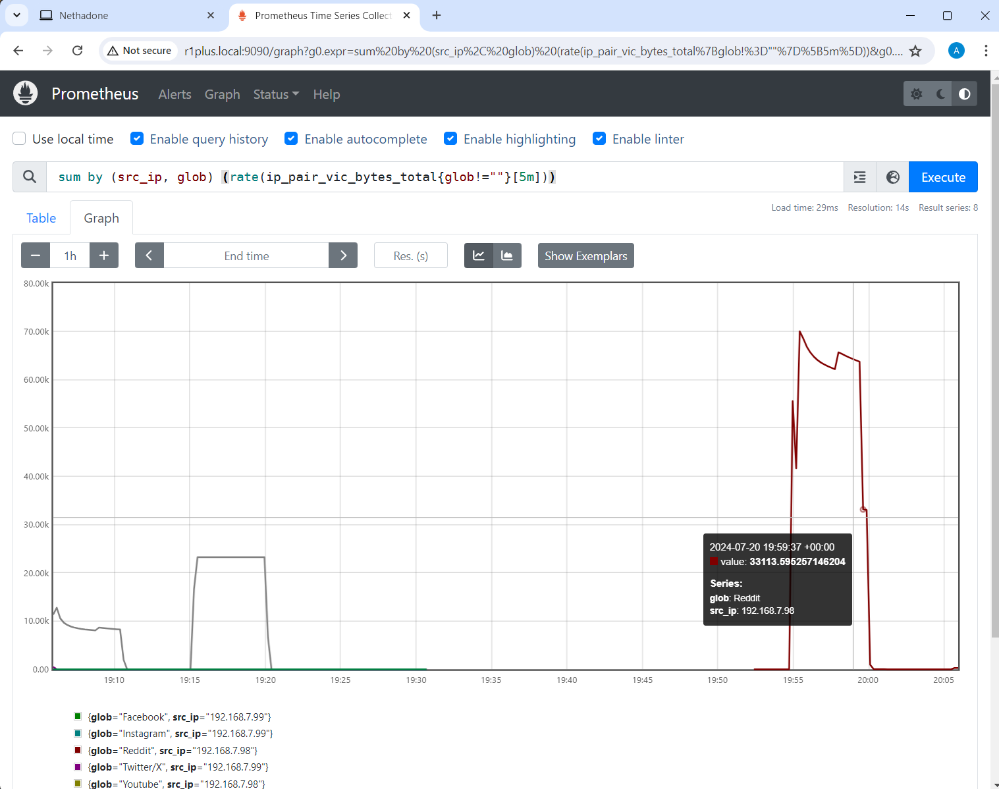
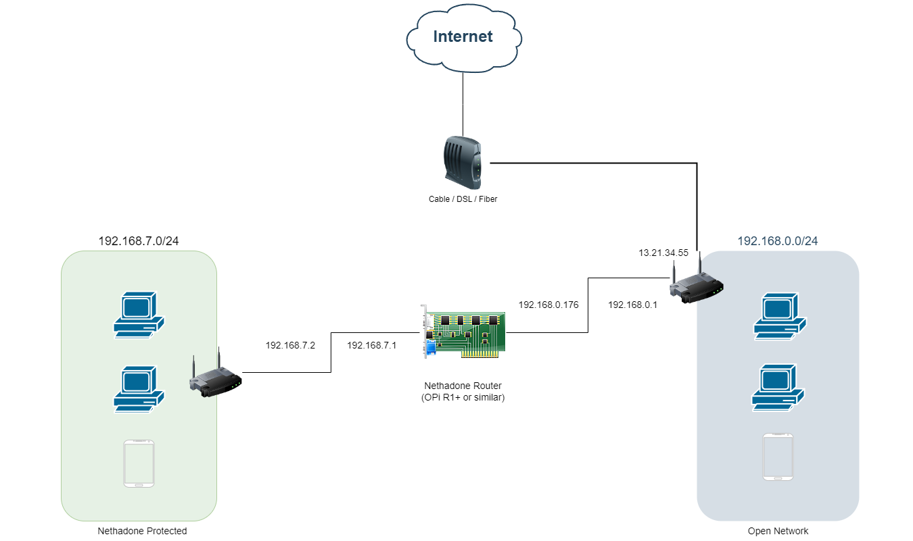

# Installation

Nethadone still, unfortunately, requires a lot of manual steps to
get working. 
It is a priority to make this installation process less cumbersome,
but anyone brave enough to attempt this in its current state
has my infinite gratitude!

## Requirements 

### Hardware 

Nethadone has been tested on:

* VMWare-based VM (for development)
* Orange Pi R1Plus / R1Plus LTS
    * 64-bit Rockchip RK3328
    * 1GB RAM
    * 2x GBit ethernet
    * Wifi (not functional w/ Armbian yet)
* Orange Pi R1
    * 32-bit Allwinner H3
    * 2 x 100Mbit ethernet
    * Wifi (working)
    * 256MB / 512MB RAM 

In theory, any device with two network interfaces should work, but I have not had a chance to test others.

An SD card 16GB or greater is recommended.

### OS 

Ubuntu-based 22.04 LTS or derivative (eg. Armbian 23.8)
Ubuntu 22.04 or 24.04 LTS and derivatives (i.e. Armbian) are working

Other OS versions may work, but the further away from Linux 
6.1 (either newer or older), the more likely eBPF
issues may be encountered.

## OS Setup - Orange Pi R1+ (Arm64)

> [!NOTE]  
> I am in the process of streamlining this installation process, 
> first for the armv7 Orange Pi R1 and eventually for the R1+. 

### Base image
For the Orange Pi R1+, you need to get the Armbian 23.8.1 Jammy build:

https://xogium.performanceservers.nl/archive/orangepi-r1plus/archive/Armbian_23.8.1_Orangepi-r1plus_jammy_current_6.1.50.img.xz

This is because we will need to use a BTF-enabled kernel provided
by [daeuniverse](https://github.com/daeuniverse/armbian-btf-kernel),
and that is the latest version of Armbian provided there.

### Image prep

The contents of `scripts/customize-image.sh` will need to be run, 
as root, in a fresh installation of the image you downlaoded. 
If you want to save time, you can prep this on your machine using
the chroot build script, eg:

```bash
cd scripts
./build.sh -i /tmp/Armbian_23.8.1_Orangepi-r1plus_jammy_current_6.1.50.img -m ~/mnt
```

Replace the `-i` and `-m` options with wherever you uncompressed the
Armbian image above, and an empty folder to use for a mount point.

`build.sh` is just a chroot wrapper that pre-installs everything
required for nethadone to run; if you prefer to do the installation 
of required packages directly, you can copy paste from 
`customize-image.sh` after you have flashed the base image using 
[Balena etcher](https://etcher.balena.io/) or whichever flashing tool you prefer.

### Nethadone installation

Once you have the image flashed and the device booted, at this 
point you should be ready to install Nethadone.

First clone the repo as regular user (but one with sudo privilege)

```bash
git clone https://github.com/atomic77/nethadone
```

The default configuration file should work on an r1plus, and you
can run this to build and launch:

```bash
make run-root
```


If all goes well and nethadone is routing and inspecting traffic, 
you should see log entries like:

```bash
...
2024/07/20 15:48:58 Registering prometheus metrics
2024/07/20 15:48:58 Setting up SimpleLoadAverage policy
2024/07/20 15:48:58 Setting up metrics collector
2024/07/20 15:48:58 Setting up metrics collector

 ┌───────────────────────────────────────────────────┐
 │                   Fiber v2.52.4                   │
 │               http://127.0.0.1:3000               │
 │       (bound on host 0.0.0.0 and port 3000)       │
 │                                                   │
 │ Handlers ............ 18  Processes ........... 1 │
 │ Prefork ....... Disabled  PID ............ 185115 │
 └───────────────────────────────────────────────────┘
2024/07/20 15:51:41 Tick happened, collected  6  pairs
15:51:44 | 200 |     706.661µs | 127.0.0.1 | GET | /metrics | -
2024/07/20 15:51:56 Tick happened, collected  22  pairs
...
2024/07/20 15:52:25 Checking policy
2024/07/20 15:52:25 Found  0  globs for throttling
2024/07/20 15:52:25 0  globs that can be decreased
```

You can inspect the qdisc and class configuration with:

```bash
$ sudo tc -s class show dev lan0
class htb 1:10 parent 1:1 leaf 10: prio 0 rate 95Mbit ceil 95Mbit burst 1579b cburst 1579b
 Sent 0 bytes 0 pkt (dropped 0, overlimits 0 requeues 0)
 backlog 0b 0p requeues 0
 lended: 0 borrowed: 0 giants: 0
 tokens: 2093 ctokens: 2093

class htb 1:1 root rate 100Mbit ceil 100Mbit burst 1600b cburst 1600b
 Sent 0 bytes 0 pkt (dropped 0, overlimits 0 requeues 0)
 backlog 0b 0p requeues 0
 lended: 0 borrowed: 0 giants: 0
 tokens: 2000 ctokens: 2000

...

class htb 1:60 parent 1:1 leaf 60: prio 0 rate 50Kbit ceil 50Kbit burst 1600b cburst 1600b
 Sent 0 bytes 0 pkt (dropped 0, overlimits 0 requeues 0)
 backlog 0b 0p requeues 0
 lended: 0 borrowed: 0 giants: 0
 tokens: 4000000 ctokens: 4000000

$ sudo tc -s qdisc show dev lan0
qdisc htb 1: root refcnt 2 r2q 10 default 0x10 direct_packets_stat 3568 direct_qlen 1000
 Sent 11025865 bytes 8567 pkt (dropped 0, overlimits 0 requeues 1)
 backlog 0b 0p requeues 1
qdisc netem 30: parent 1:30 limit 1000 delay 20ms  2ms
 Sent 0 bytes 0 pkt (dropped 0, overlimits 0 requeues 0)
 backlog 0b 0p requeues 0
...
qdisc clsact ffff: parent ffff:fff1
 Sent 11025865 bytes 8567 pkt (dropped 0, overlimits 0 requeues 0)
 backlog 0b 0p requeues 0

```

There is a basic admin interface where you can configure glob
groups, see the currently active policy and inspect currently
mapped DNS to IP addresses, it will be running at:

http://r1plus.local:3000/

mDNS is configured by default - if this address does not resolve
on your network, replace `r1plus.local` with whatever IP address
was assigned. 

Example glob group configuration:



If DNS packet inspection is working, you should see IP addresses
mapped to likely domains on the bandwidth page:



The local prometheus server that is used for policy decisions
should be available on port 9090, and you can check that metrics
are being collected there using similar queries used by nethadone:




### Routing Configuration & Client setup

One of the design goals of Nethadone is to introduce minimal or
no client configuration beyond DHCP. The growing use of DNS over
HTTPS (DoH), unfortunately complicates this, as it prevents 
Nethadone from using the typical UDP DNS packets to associate
a client-requested domain with an IP address.

In practice, the best way to work around this is to install 
[pi-hole](https://github.com/pi-hole/pi-hole)
on the same device. Most client devices on your network, if provided
a local DNS server in the DHCP configuration, will automatically
switch to UDP-based DNS, and Nethadone will be able to inspect these
packets. Installing pi-hole on a non-raspberry pi is
straight-forward though not officially supported, I have created a
[youtube video with instructions](https://www.youtube.com/watch?v=m-mIglWyFcs) for installation on an orangepi zero that should work fine against a R1plus.

Alternatively, you can configure browsers to 
[disable the use of DoH](https://www.expressvpn.com/support/troubleshooting/disable-dns-over-https/).


## Deployment

The recommended way of starting out with Nethadone is to create
a separate, 'protected' network, potentially using a old
spare wifi router. This is how it looks in my environment:



Ideally, the wifi found on a board like the Orange Pi R1+ could
be used directly to create an isolated netwrk, but as of this time, Armbian does not have good support for the hardware. 

If you are confident that your setup is good, you can then introduce Nethadone in between your primary access point and
your cable/DSL/fiber provider.
