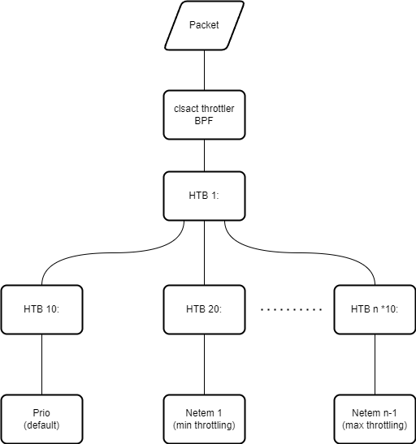

## QDisc Traffic Control Setup

On startup, Nethadone sets up a configurable number of "bandwidth classes" to enable a steady degradation
of service to flagged addresses. The design is inspired by this 
[netdev 0x14 paper](https://netdevconf.info//0x14/pub/papers/55/0x14-paper55-talk-paper.pdf), 
and the examples in the [Traffic Control HOWTO](https://lartc.org/lartc.html).

The following is a rough representation of the qdisc layout:

The throttler BPF is a templated C file that is dynamically
generated, recompiled and attached to the `clsact` qdisc on the 
LAN-side interface based on traffic patterns. Its sole responsibility is to assign traffic to classes `0x10`, `0x20`, .. etc.
up to a configurable max. 

HTB / Prio is the default, and is configured with no artificial delays (at least not intentionally :). 
Based on the configured policy, the throttler will dynamically 
adjust the class of outbound traffic to different classes from `0x20` upwards. 
These have [`netem`](https://www.man7.org/linux/man-pages/man8/tc-netem.8.html) qdiscs configured with increasing delay and latency and reduced bandwidth. 

The intended effect for a user on the network accessing a restricted site is as if their
connection starts as a fast cable modem and degrades down to something like a 2G or 3G cellular connection. The rates and number of classes are configurable in the `nethadone.yml` file.

